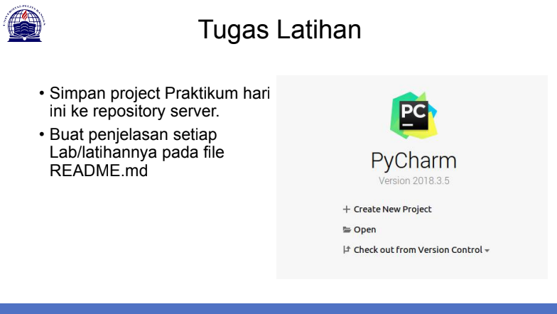
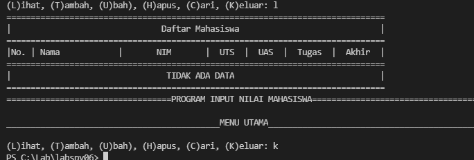

# **Tugas Pemrograman**
>                                My Profil
```sh
Nama  : Aef Saefuddin

Nim   : 312110521

Kelas : T1.21.C5
```

>                              Tugas Latihan



## **Latihan** 
- Ubahlah kode dibawah ini menjadi fungsi menggunakan *lambda*.

```py
import math
def a(x):
    return x**2
def b(x, y)
    return math.sqrt(x**2 + y**2)  
def c(*args):
    return sum(args)/len(args)
def d(s):
    return "".join(set(s))
```

### *Syntax*
Kita dapat Mengerjakan Menggunakan *Syntax* yang ada dibawah ini.

```py
import math
def a(x):
    return x**2
    a = lambda x : x ** 2
print(a(2))

def b(x, y):
    return math.sqrt(x*2 + y*2)
    b = lambda x, y : x * 2  + y * 2
print(b(2, 2))

def c(*args):
    return sum(args)/len(args)
    c = lambda *args : sum(args)/len(args)
print(c(5, -1, 8, 19))

def d(s):
    return "".join(set(s))
    d = lambda s: "".join(set(s))
print(d("Jenab"))
```

### *Penjelasan*
- Untuk memperluas daftar fungsi matematika gunakan `import math`;

- Fungsi lambda yang menggunakan variabel a-d.

```py
def a(x):
    return x**2
    a = lambda x : x ** 2
print(a(2))
def b(x, y):
    return math.sqrt(x**2 + y**2)
    b = lambda x, y : x ** 2  + y ** 2
print(b(2, 2))
def c(*args):
    return sum(args)/len(args)
    c = lambda *args : sum(args)/len(args)
print(c(5, -1, 8, 19))
def d(s):
    return "".join(set(s))
    d = lambda s: "".join(set(s))
print(d("Jenab"))
```

### *Output*
Dari *Syntax* yang sudah kita kerjakan diatas maka menghasilkan Output yang ada dibawah ini.


## **Praktikum**
> Buat program sederhana dengan mengaplikasikan penggunaan fungsi yang akan menampilkan daftar nilai mahasiswa, dengan ketentuan:
> - Fungsi *tambah()* untuk menambah data;
> - Fungsi *tampilkan()* untuk menampilkan data;
> - Fungsi *hapus(nama)* untuk menghapus data berdasarkan nama;
> - Fungsi *ubah(nama)* untuk mengubah data berdasarkan nama;
> - Buatlah flowchart dan penjelasan programnya pada README.md.

### *Syntax*
Kita bisa menggunakan *Syntax* yang ada dibawah ini untuk mengerjakan soal yang ada diatas.

```py
data = {}

while True:
    header="PROGRAM INPUT NILAI MAHASISWA"
    header2=("MENU UTAMA")
    print(header.center(97,"="))
    print()
    print(header2.center(97,"_"))
    c = input("\n(L)ihat, (T)ambah, (U)bah), (H)apus, (C)ari, (K)eluar: ")

    if c.lower() == 't':
        print("Tambah Data")
        nama = input("Nama\t\t: ")
        nim = int(input("NIM\t\t: "))
        uts = int(input("Nilai UTS\t: "))
        uas = int(input("Nilai UAS\t: "))
        tugas = int(input("Nilai Tugas\t: "))
        akhir = tugas*30/100 + uts*35/100 + uas*35/100
        data[nama] = nim, uts, uas, tugas, akhir

    elif c.lower() == 'u':
        print("Ubah Data")
        nama = input("Masukkan Nama   : ")
        if nama in data.keys():
            nim = int(input("NIM\t\t: "))
            uts = int(input("Nilai UTS\t: "))
            uas = int(input("Nilai UAS\t: "))
            tugas = int(input("Nilai Tugas\t: "))
            akhir = tugas*30/100 + uts*35/100 + uas*35/100
            data[nama] = nim, uts, uas, tugas, akhir
        
        else:
            print("Nama {0} tidak ditemukan".format(nama))

    elif c.lower() == 'h':
        print("Hapus Data")
        nama = input("Masukkan Nama  : ")
        if nama in data.keys():
            del data[nama]
        else:
            print("Nama {0} Tidak Ditemukan".format(nama))

    elif c.lower() == 'c':
        print("Cari Data[case-sensitive]")
        nama = input("Masukkan Nama : ")
        if nama in data.keys():
            print("="*73)
            print("|                             Daftar Mahasiswa                          |")
            print("="*73)
            print("| Nama            |       NIM       |  UTS  |  UAS  |  Tugas  |  Akhir  |")
            print("="*73)
            print("| {0:15s} | {1:15d} | {2:5d} | {3:5d} | {4:7d} | {5:7.2f} |"
                  .format(nama, nim, uts, uas, tugas, akhir))
            print("="*73)
        else:
            print("Nama {0} Tidak Ditemukan".format(nama))

    elif c.lower() == 'l':
        if data.items():
            print("="*78)
            print("|                               Daftar Mahasiswa                             |")
            print("="*78)
            print("|No. | Nama            |       NIM       |  UTS  |  UAS  |  Tugas  |  Akhir  |")
            print("="*78)
            i = 0
            for z in data.items():
                i += 1
                print("| {no:2d} | {0:15s} | {1:15d} | {2:5d} | {3:5d} | {4:7d} | {5:7.2f} |"
                      .format(z[0][:13], z[1][0], z[1][1], z[1][2], z[1][3], z[1][4], no=i))
            print("=" * 78)
        else:
            print("="*78)
            print("|                               Daftar Mahasiswa                             |")
            print("="*78)
            print("|No. | Nama            |       NIM       |  UTS  |  UAS  |  Tugas  |  Akhir  |")
            print("="*78)
            print("|                                TIDAK ADA DATA                              |")
            print("="*78)

    elif c. lower() == 'k':
        break

    else:
        print("Pilih menu yang tersedia")
```

### *Penjelasan*
>Buatlah dictionary yang akan diinput dengan data
```py
data = {}
```

>Membuat perulangan dan keterangan untuk pilihan menu
```py
while True:
    c = input("\n(L)ihat, (T)ambah, (U)bah), (H)apus, (C)ari, (K)eluar: ")
```

>Menambahkan data yang akan diinput kemudian masuk ke dalam dictionary

```py
if c.lower() == 't':
        print("Tambah Data")
        nama = input("Nama\t\t: ")
        nim = int(input("NIM\t\t: "))
        uts = int(input("Nilai UTS\t: "))
        uas = int(input("Nilai UAS\t: "))
        tugas = int(input("Nilai Tugas\t: "))
        akhir = tugas*30/100 + uts*35/100 + uas*35/100
        data[nama] = nim, uts, uas, tugas, akhir
```

Output Menambahkan Data


>Jika ingin menampilkan data dapat menggunakan
```py
elif c.lower() == 'l':
        if data.items():
            print("="*78)
            print("|                               Daftar Mahasiswa                             |")
            print("="*78)
            print("|No. | Nama            |       NIM       |  UTS  |  UAS  |  Tugas  |  Akhir  |")
            print("="*78)
            i = 0
            for z in data.items():
                i += 1
                print("| {no:2d} | {0:15s} | {1:15d} | {2:5d} | {3:5d} | {4:7d} | {5:7.2f} |"
                      .format(z[0][:13], z[1][0], z[1][1], z[1][2], z[1][3], z[1][4], no=i))
            print("=" * 78)
        else:
            print("="*78)
            print("|                               Daftar Mahasiswa                             |")
            print("="*78)
            print("|No. | Nama            |       NIM       |  UTS  |  UAS  |  Tugas  |  Akhir  |")
            print("="*78)
            print("|                                TIDAK ADA DATA                              |")
            print("="*78)
```

Output Melihat Data


>Mengubah data dapat menggunakan 
```py
elif c.lower() == 'u':
        print("Ubah Data")
        nama = input("Masukkan Nama   : ")
        if nama in data.keys():
            nim = int(input("NIM\t\t: "))
            uts = int(input("Nilai UTS\t: "))
            uas = int(input("Nilai UAS\t: "))
            tugas = int(input("Nilai Tugas\t: "))
            akhir = tugas*30/100 + uts*35/100 + uas*35/100
            data[nama] = nim, uts, uas, tugas, akhir
        else:
            print("Nama {0} tidak ditemukan".format(nama))
```

Output Mengubah Data


>Menghapus data dapat menggunakan
```py
elif c.lower() == 'h':
        print("Hapus Data")
        nama = input("Masukkan Nama  : ")
        if nama in data.keys():
            del data[nama]
        else:
            print("Nama {0} Tidak Ditemukan".format(nama))
```

Output Menghapus Data


>Mencari data dapat menggunakan
```py
 elif c.lower() == 'c':
        print("Cari Data[case-sensitive]")
        nama = input("Masukkan Nama : ")
        if nama in data.keys():
            print("="*73)
            print("|                             Daftar Mahasiswa                          |")
            print("="*73)
            print("| Nama            |       NIM       |  UTS  |  UAS  |  Tugas  |  Akhir  |")
            print("="*73)
            print("| {0:15s} | {1:15d} | {2:5d} | {3:5d} | {4:7d} | {5:7.2f} |"
                  .format(nama, nim, uts, uas, tugas, akhir))
            print("="*73)
        else:
            print("Nama {0} Tidak Ditemukan".format(nama))
```

Output Mencari Data


>Jika sudah selesai input pilih menu 'K' untuk memberhentikan program
```py
elif c. lower() == 'k':
        break
```
Output Melihat Data dan Keluar dari Program.


#### Flowchart


>                          Sekian dan Terima Kasih